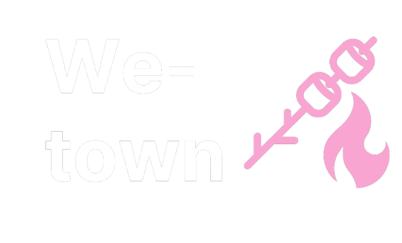

# We-Town

## Table of contents

- [Overview](#overview)
  - [The inspiration](#the-inspiration)
  - [What it does](#what-it-does)
- [Our process](#our-process)
  - [How we built it](#how-we-built-it)
  - [Challenges we ran into](#challenges-we-ran-into)
  - [Accomplishments that we're proud of](#accomplishments-that-we're-proud-of)

### Application Screenshots
#### Account Creation

#### Account Authentication

#### Postings Dashboard

#### Postings Output

## Overview

### The inspiration
Nowadays, we see the rise of social media apps causing young adults and teenagers to become less social, resulting in several negative social, behavioral changes.
Additionally, many people are finding it difficult to connect with their neighborhood and community organizations. Our team wanted to find a solution to the growing lack of social development in young adults and teenagers. Hence, we created We-Town.

### What it does
We-Town lets users only interact with other users in their neighborhood. Using a hyper-localized system, individuals can only connect with those within their communities. Users would be allowed to create posts about local community events, privately message each other, and have community hangouts.

Moreover, We-Town serves two main purposes:

- Promote community engagement and help connect neighbors. 
- Allow users to post about events or any certain activities they want others to join. 

## Our Process

### How we built it
- We built the web app using React as the front-end framework and Tailwind CSS to style the various components.
- We used CockroachDB as the database storing all of the important information and Node.Js and Express.Js for the backend procedures.
- We also used the Google Map API to calculate the longitude and latitude of each user person so that we can calculate the distance of each poster from a user.

### Challenges we ran into
- There were a lot of features to incorporate in this project, given the time constraints. However, we were able to accomplish the primary purpose of our project, which was to provide a way for people to engage with each other whether that be to purchase from each other or to just have a fun time together.
- Not being able to communicate face to face meant we had to rely on digital apps, which made it difficult to brainstorm concepts and ideas. This was exceptionally challenging when we had to work together to discuss potential changes or help debug issues.
- Brainstorming ways to combine multiple technologies in an ambitious manner was quite a creative exercise and our idea had gone through multiple iterations until it was refined.

### Accomplishments that we're proud of
- We're proud that our implementation of the user authentication and postings works as we intended. We're also proud of having the front-end and back-end working simultaneously.

#### What we learned
- We learned how to use CockroachDB, Tailwind CSS, and overall how to fully integrate the back-end and the front-end together.
- Some of us also improved our understanding of how to use Git for large team projects.

## License

This project is licensed under the MIT License - see the LICENSE.md file for details
